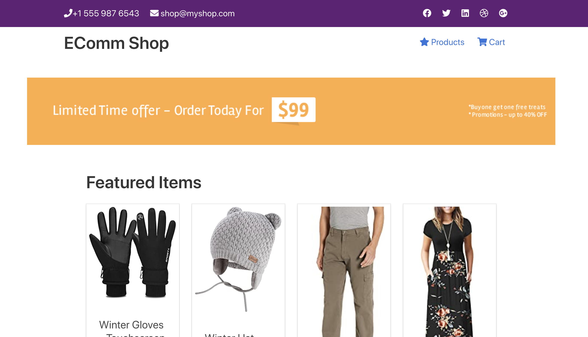
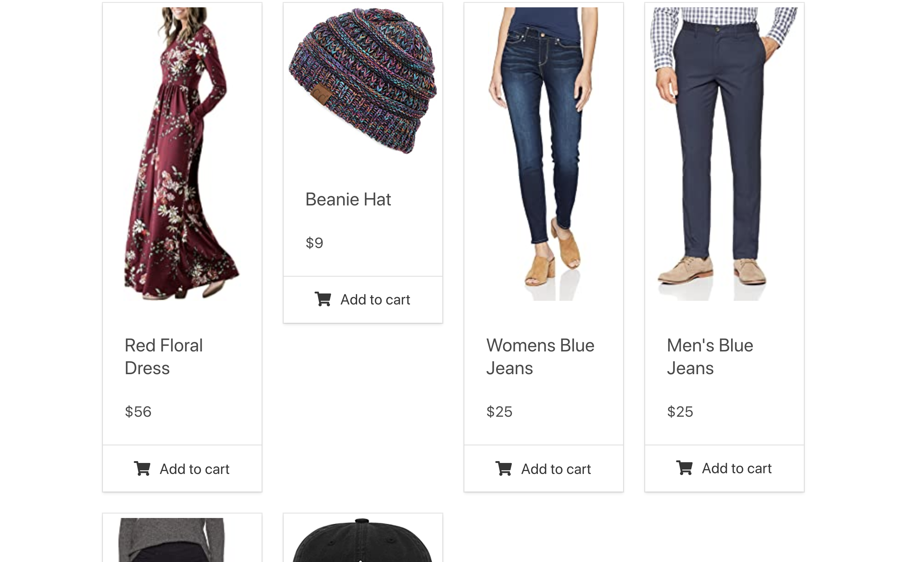
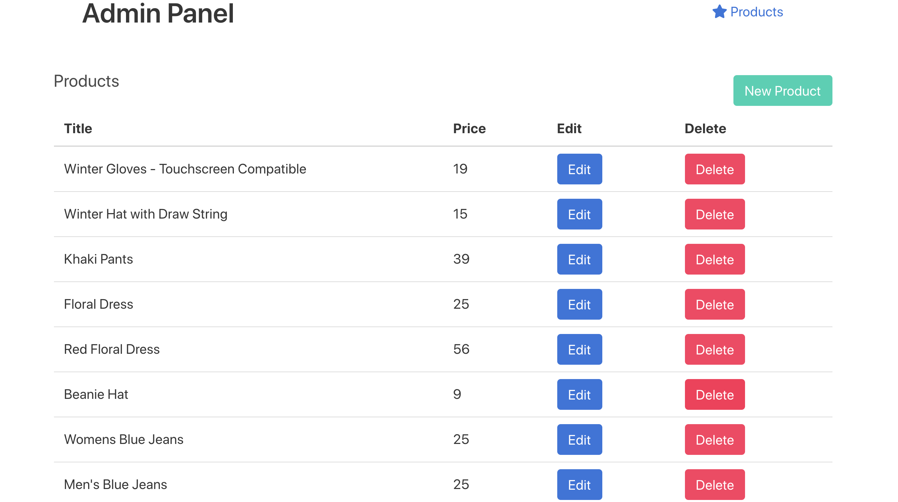
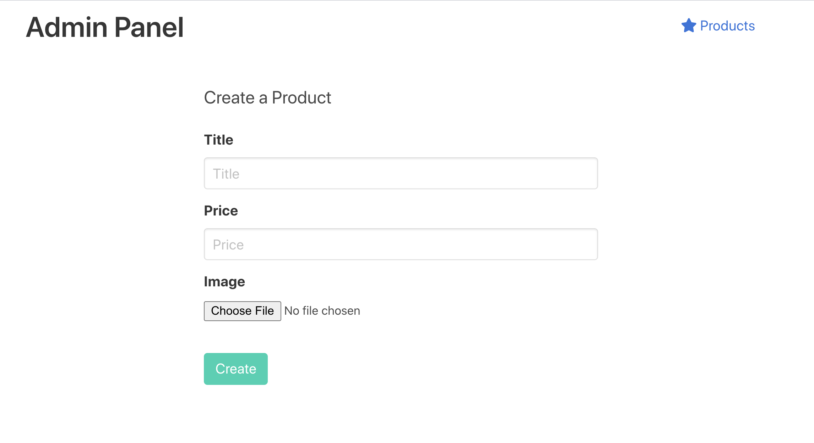
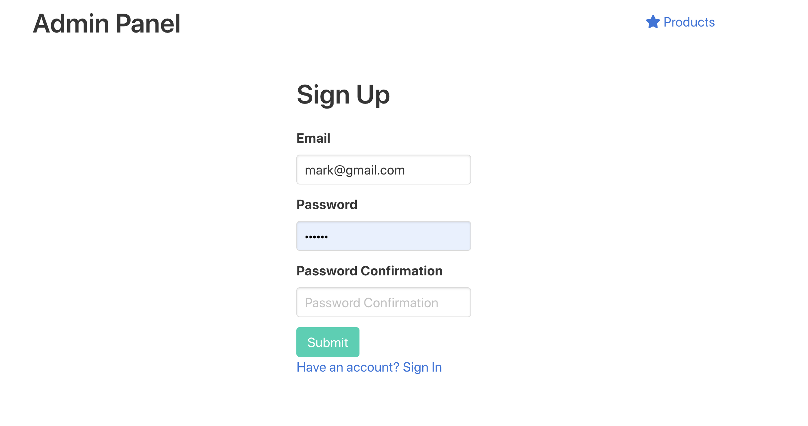
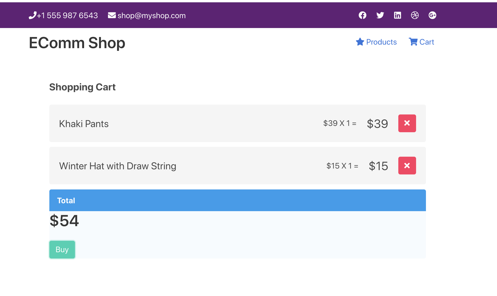

# E-commerce 

## Installation

- Make sure `Node` is installed.
- Download the dependencies with `npm install`
- Run the project on `http://localhost:3000/` with `npm start`

### User interface 

App allows users to view items and shop, add them to a cart and eventually attempt to purchase them.

### Admin panel 

Administer has the ability to add new items, edit existing ones or delete existing ones as well.

### Authentication 

User's session saved into cookie-session to authenticate the user.

If a user decides to create a product or edit an existing one, user fills out a form for the product. User should be signed up to the app to access the admin panel.

As an administrator in order to access the admin panel, we have Sign-up and Sign-in pages. Sign-in and sign-up is only for access
to the admin panel.

So only administrators are required to log into the Web site, an end user or like a customer can browse all these different items and have a shopping cart without logging in at all.

### Users

- customers
- administrators 

### Database and password validation

Users are saved into database and passwords are hashed and salted. Also, input values are validated with express-validator.

